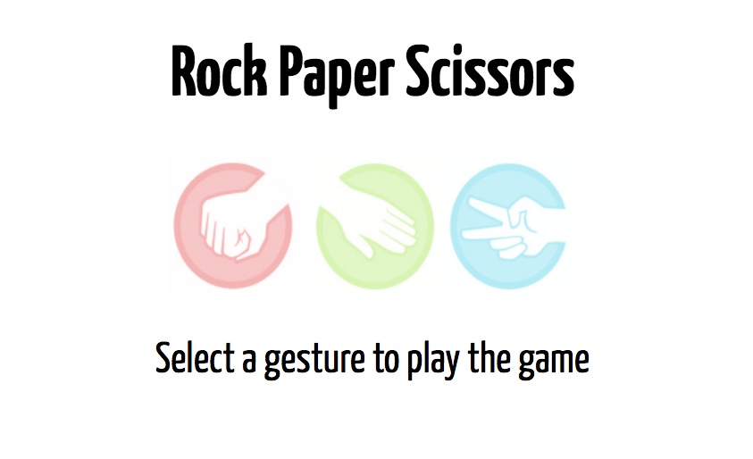

Rock Paper Scissors Game In JavaScript
========================

[Play a game of RPS HERE](https://agile-island-47247.herokuapp.com/)

A classic game of rock, paper, scissors using JavaScript, TDD and Sinatra, then deployed to Heroku.




Technologies Used:
-----------
- JavaScript
- jQuery
- Jasmine
- Sinatra
- GitHub
- Command Line
- Heroku

How to use
----------
Clone the repository:
```shell
$ git clone https://github.com/alexfakhri/Rock-Paper-Scissors-in-JavaScript.git
```

Change into the directory:
```shell
$ cd Rock-Paper-Scissors-in-JavaScript
```

To see Jasmine tests:
```shell
$ open SpecRunner.html
```

Play when in browser:
```shell
$ rackup
in broswer open: http://localhost:9292
```

------------------------------------------------
Rock, Paper, Scissors in other languages
 - [Rock, Paper, Scissors](https://github.com/alexfakhri/Rock-Paper-Scissors) in Ruby
